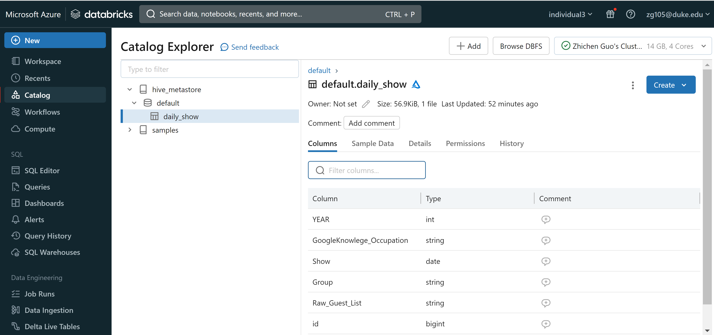
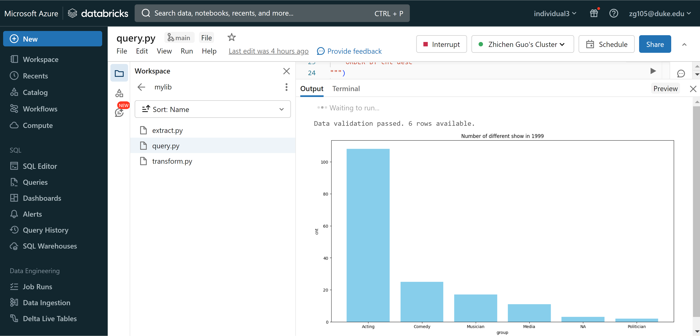

# Individual-project-zg105

The goal of this project is to build an ETL pipeline on azure Databricks, includes:
 - extract csv file from given url
 - transform csv file into a sql table
 - query on the table

## video link

## Dataset
The dataset are the date of show and its type. Below are data sources:
1. https://github.com/fivethirtyeight/data/blob/master/daily-show-guests/daily_show_guests.csv

## Steps
1. Data Extraction:

  Utilizes the requests library to fetch birth data from specified URLs.
  
  Downloads and stores the data in the Databricks FileStore.

2. Databricks Environment Setup:

  Establishes a connection to the Databricks environment using environment variables for authentication.

3. Data Transformation and Load

Transform the csv file into a Spark dataframe which is then converted into a Delta Lake Table and stored in the Databricks environement

4. Query Transformation and Vizulization:

Defines a Spark SQL query to perform a predefined transformation on the retrieved data.

Uses the predifined transformation Spark dataframe to create vizualizations

5. Automated trigger via Github Push:

I utilize the Databricks API to run a job on my Databricks workspace such that when a user pushes to this repo it will intiate a job run

## Result

